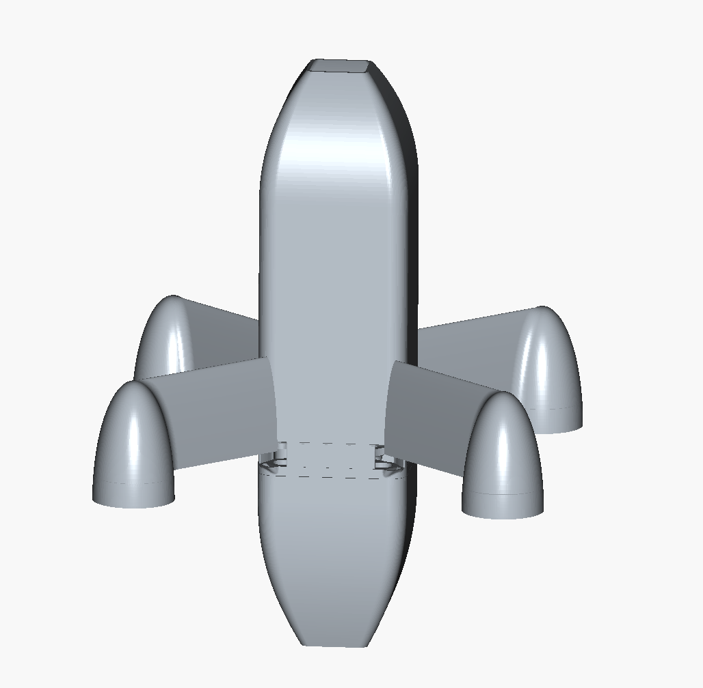
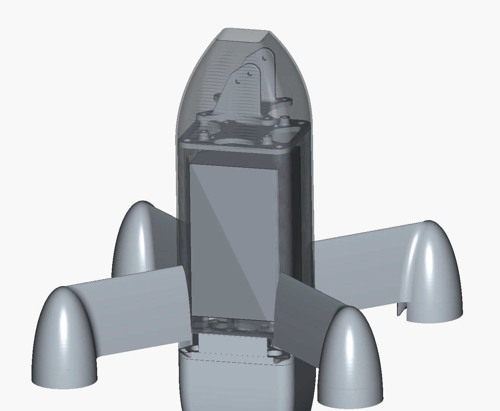
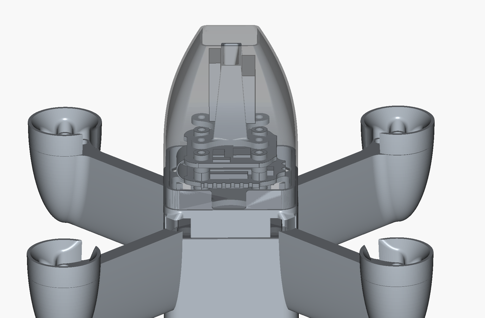

# UAV FPV Drone 

This project is a custom **4-inch FPV quadcopter** designed in FreeCAD as a small UAV platform.  
The goal is to explore CAD modelling, UAV system integration and aerodynamics while preparing for a physical build and flight testing.  

---

## Components

- Frame: movr163 cp2 4-2 mm 912
- Flight Computer: SPEEDYBEE F405 Mini Stack Flight Controller + BLS 35A Mini V2 ESC 20x20mm (16.8g)
- Receiver: Radiomaster ExpressLRS RP1 V2 Nano Receiver 2.4ghz (2.2g)
- GPU Module: Walksnail WS-M181 GPS Module with Built in Mag COPJ-18GPS
- Motors: Happymodel EX1404 Motor - 2750KV
- Prop: Low Pitch 4 inch Bi-Blade Props
- Camera: Walksnail Avatar v1 / Micro cam
- Battery: Chinahobbyline CNHL Ministar 850MAH 14.8V 4S 70C Lipo Battery (110g)
- Aerodynamic Nose Cone – custom 3D-printed design to improve airflow and protect frame and electronics  

---

## Project Images
**CAD Model**
  
  
  

---

## Key Learnings
- CAD modelling with FreeCAD for UAV and mechanical design  
- Planning component placement for balance, accessibility, and wiring  
- Designing aerodynamic features for 3D printing  
- Considering practical constraints when transitioning from CAD to physical UAV builds  

---

## Next Steps
- Assemble flight computer, GPS, and motor wiring
- Print 3D printed housing
- Conduct hover and stability tests  
- Tune PID settings 
- Ardupilot for autonomous flight capabilities

---

## Credit
- FreeCAD open-source community for CAD tools
- 3D Printed Aerodynamic Nose Cone STL files designed by **quadmovr9** (purchased designs)
